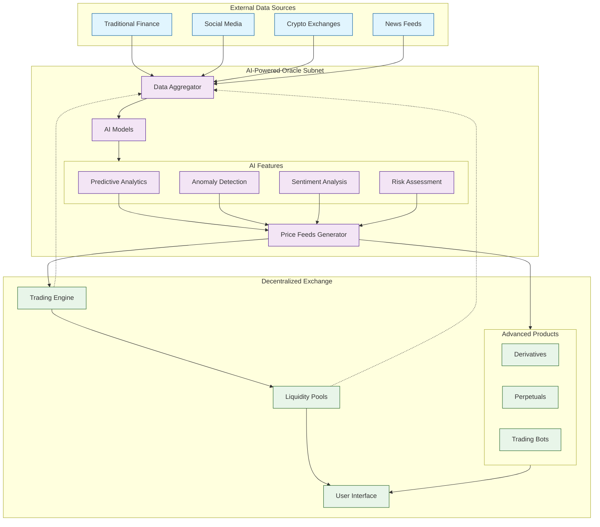

## TaoSwap Finance

TaoSwap Finance is a series of financial primitives for the Bittensor Ecosystem

## Prerequisites

- Node.js
- MetaMask extension (with two different accounts)
- PNPM

## Getting Started

Local DEX setup:

1. Download metamask and create two accounts
2. Add the private keys from .env.local to the two accounts
3. Install dependencies with `pnpm install`

Repeat this each time you restart your development environment:

1. Run `pnpm run node` to start the local network
2. In a second terminal run `pnpm run deploy-dex-local` to deploy everything

This deployment command will automatically:

- Deploy all contracts
- Deploy tokens (USDC, USDT, WBTC)
- Create liquidity pools
- Add initial liquidity
- Verify the setup

You can also run individual deployment steps if needed:

2. Run `npx hardhat run --network localhost scripts/01_deployContracts.js` to deploy the contracts
3. Now deploy the tokens with `npx hardhat run --network localhost scripts/02_deployTokens.js`
4. Now deploy the pools with `npx hardhat run --network localhost scripts/03_deployPools.js`
5. Now add liquidity to the pools with `npx hardhat run --network localhost scripts/04_addLiquidity.js`
6. Now check the liquidity with `npx hardhat run --network localhost scripts/05_checkLiquidity.js`

Advanced Dex architecture:

